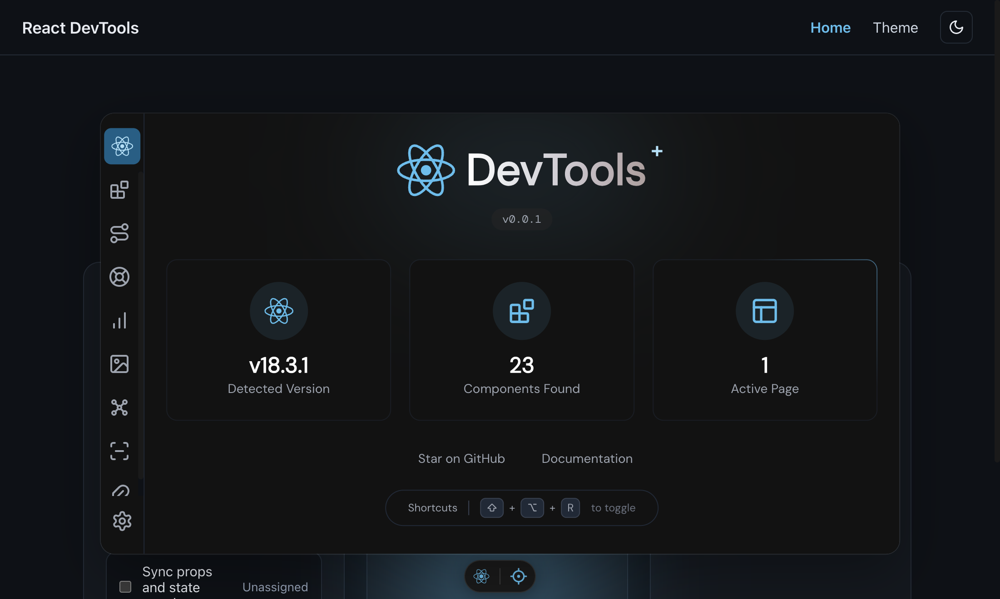

<p align="center">
  
</p>

<h1 align="center">React DevTools Plus</h1>

<p align="center">
  <strong>React debugging made simple.</strong>
</p>

<p align="center">
  An open-source overlay and build tool plugin that mirrors your React Fiber tree, profiles renders, and keeps production builds untouched.
</p>

<p align="center">
  <a href="https://www.npmjs.com/package/react-devtools-plus"></a>
  <a href="https://github.com/wzc520pyfm/react-devtools-plus/blob/main/LICENSE"></a>
  <a href="https://www.npmjs.com/package/react-devtools-plus"></a>
</p>

<p align="center">
  <a href="#features">Features</a> •
  <a href="#quick-start">Quick Start</a> •
  <a href="#configuration">Configuration</a> •
  <a href="#documentation">Documentation</a> •
  <a href="#contributing">Contributing</a>
</p>

---

## ✨ Features

- 🚀 **Drop-in Plugin** - Works with Vite and Webpack out of the box
- 🔍 **Fiber Mirror** - Automatic instrumentation of React Fiber roots to mirror component trees
- ⌨️ **Keyboard-first** - Toggle with `Option/Alt + Shift + D`, no browser extension needed
- 📦 **Dev-only** - Zero impact on production bundles, no telemetry
- 🎯 **React 16-19** - Supports React 16.8+, 17, 18, and 19
- 🛠️ **Timeline Profiling** - Track component renders and performance
- 📁 **Asset Inspection** - Browse and inspect project assets
- 🔗 **Open in Editor** - Click to open components in your IDE

## 📦 Quick Start

### Installation

```bash
# pnpm (recommended)
pnpm add -D react-devtools-plus

# npm
npm install -D react-devtools-plus

# yarn
yarn add -D react-devtools-plus
```

### Vite Setup

```ts
// vite.config.ts
import react from '@vitejs/plugin-react'
import { defineConfig } from 'vite'
import { reactDevToolsPlus } from 'react-devtools-plus/vite'

export default defineConfig({
  plugins: [
    react(),
    reactDevToolsPlus(),
  ],
})
```

### Webpack Setup

```js
// webpack.config.js
const { reactDevToolsPlus } = require('react-devtools-plus/webpack')

module.exports = {
  plugins: [
    reactDevToolsPlus(),
  ],
}
```

### Access DevTools

Once configured, you can access the DevTools in two ways:

1. **Navigate to** `http://localhost:5173/__react_devtools__/`
2. **Press** `Option/Alt + Shift + D` to toggle the floating overlay

## ⚙️ Configuration

```ts
import { reactDevToolsPlus } from 'react-devtools-plus/vite'

reactDevToolsPlus({
  // Enable/disable the overlay (default: true in dev)
  overlay: true,

  // Customize the DevTools route (default: '/__react_devtools__')
  base: '/__react_devtools__',

  // Configure Open in Editor (default: auto-detect)
  launchEditor: 'code', // 'code' | 'webstorm' | 'cursor' | etc.
})
```

## 📖 Documentation

For comprehensive documentation, visit our [documentation site](./docs).

### Core Features

| Feature            | Description                                                |
| ------------------ | ---------------------------------------------------------- |
| **Component Tree** | Visualize your React component hierarchy in real-time      |
| **Timeline**       | Profile component renders and track performance over time  |
| **Assets**         | Browse and inspect images, fonts, and other project assets |
| **Open in Editor** | Click any component to jump to its source code             |
| **Settings**       | Customize DevTools behavior and appearance                 |

### Keyboard Shortcuts

| Shortcut                 | Action                           |
| ------------------------ | -------------------------------- |
| `Option/Alt + Shift + D` | Toggle DevTools panel open/close |
| `Option/Alt + Shift + R` | Toggle overlay visibility        |
| `Escape`                 | Close overlay                    |

## 🏗️ Project Structure

This is a monorepo managed with pnpm workspaces and Turborepo:

```
packages/
├── react-devtools/           # Main Vite/Webpack plugin
├── react-devtools-client/    # DevTools client UI
├── react-devtools-core/      # Core functionality & plugin system
├── react-devtools-kit/       # State management & messaging
├── react-devtools-overlay/   # Floating overlay component
├── react-devtools-scan/      # Render scanning utilities
├── react-devtools-ui/        # Shared UI components
├── shared/                   # Shared utilities
└── playground/               # Example projects
    ├── react/                # Vite + React example
    ├── react-webpack/        # Webpack + React example
    └── ...
```

## 🧑‍💻 Development

```bash
# Install dependencies
pnpm install

# Start development mode
pnpm dev

# Run the Vite playground
pnpm play

# Run the Webpack playground
pnpm play:webpack

# Build all packages
pnpm build

# Run tests
pnpm test

# Lint code
pnpm lint
```

## 🤝 Contributing

We welcome contributions! Here's how you can help:

1. **Star the repo** - Signal demand and support the project
2. **Open issues** - Report bugs or request features
3. **Submit PRs** - Fix bugs, add features, improve docs
4. **Share feedback** - Tell us about your stack and pain points

See [CONTRIBUTING.md](./CONTRIBUTING.md) for detailed guidelines.

### Development Requirements

- Node.js >= 14.0.0
- pnpm >= 10.0.0

## 📄 License

MIT © [wzc520pyfm](https://github.com/wzc520pyfm)

---

<p align="center">
  <sub>Built with ❤️ for the React community</sub>
</p>
